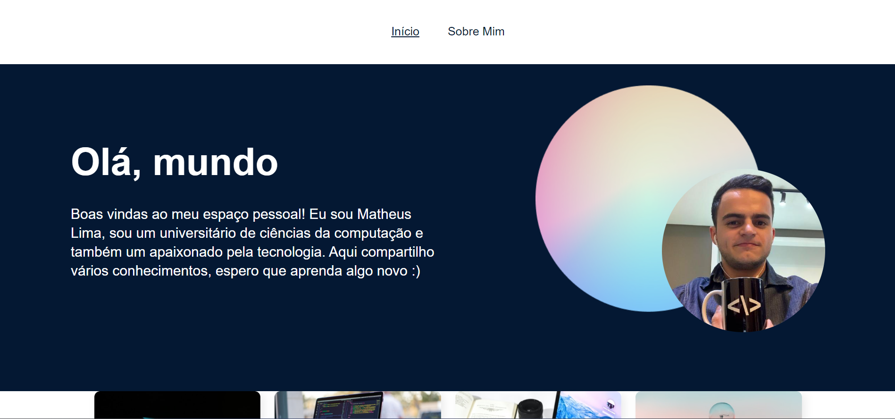
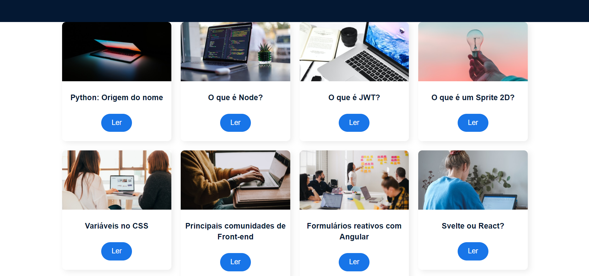
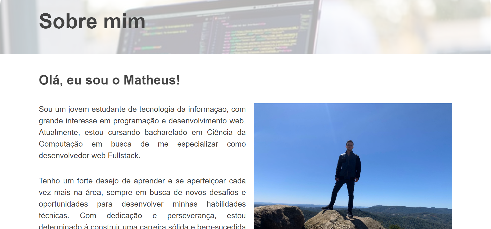
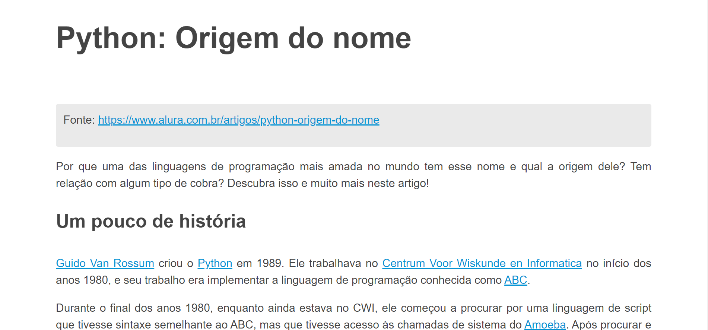
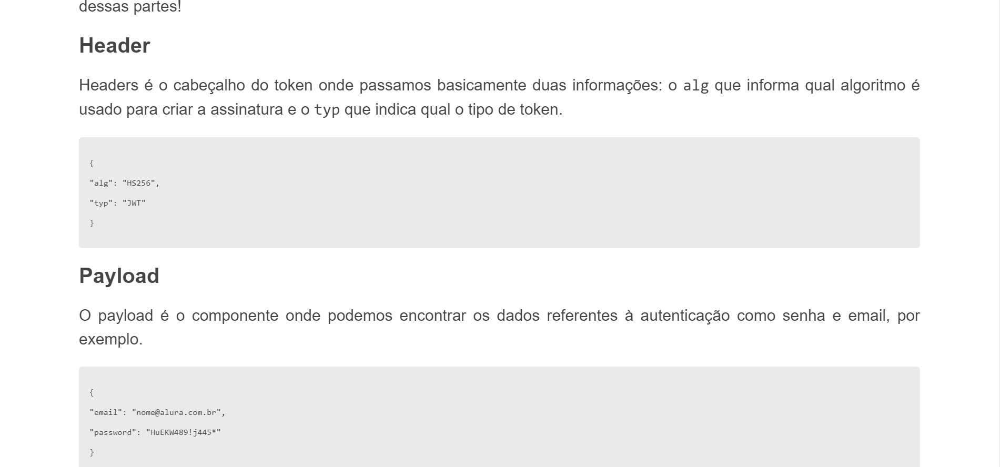
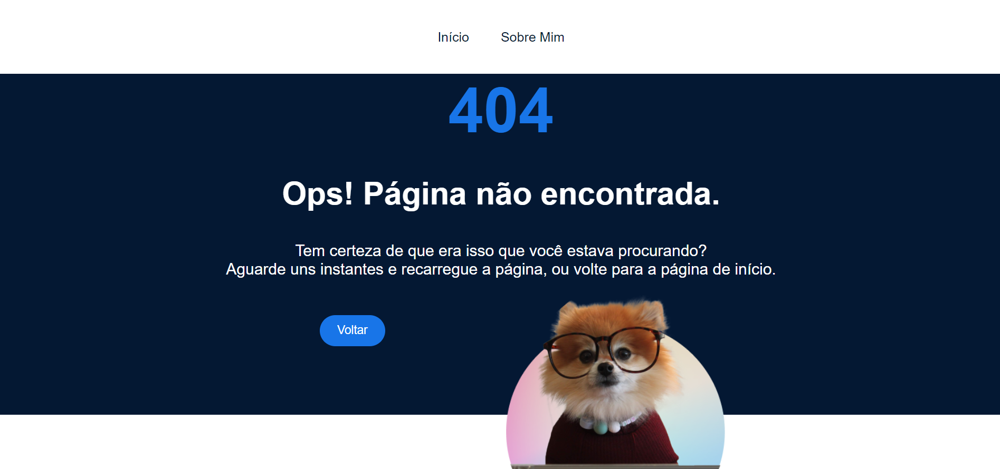

# WebSite Sobre mim

| :placard: Vitrine.Dev | Matheus da Trindade Lima |
| -------------  | --- |
| :sparkles: Name        | **WebSite Sobre mim**
| :label: Technologies | React
| :bulb: Skills        | Desenvolvendo um WebSite em React, utilizando a biblioteca react-router-dom.

# WebSite AluraSpace
<p>
  Nesse projeto realizado junto com a plataforma alura, utilizei o react-router-dom (versão 6), para fazer um WebSite com rotas e navegação, usando os componentes de rotas dessa biblioteca como: BrowserRouter, Router e Route. 
</p>
  Também observei a diferença na prática entre sites tradicionais e de SPAs, pois sites tradicionais são compostos por várias páginas HTML, e uma requisição é realizada para o servidor do site sempre que queremos ir para uma nova página. Já as SPAs são compostas por uma única página HTML, e seu conteúdo é alterado dinamicamente pelo JavaScript. Um exemplo disso, é a utilização da tag Link no JSX, que não faz uma requisição para o servidor com um tag de âncora faria no HTML.
<p>
  Utilizei alguns Hooks nesse projeto como: useLocation para obter informações da rota em que atualmente. useParams para obtermos os parâmetros para uma rota dinâmica. e também o useNavigate para fazermos navegação mais complexas, como voltar para a página anterior no navegador.
</p>
  E por fim mas não menos importante, fiz um componente chamado de NaoEncontrada para quando um post ou uma página não for encontrada, o react renderizar esse componente de erro 404.
<p>

## Layout web

### Página inicial



### Página sobre mim


### Página dos posts



### Página de erro 404


Clonar repositório

```bash
  https://github.com/Limatrindade/curso-alura-lib-rotas
```

## Front-end
Pré-requisitos: Navegador

Editar com IDE ou Editor de preferência.

Acessar utilizando navegador de preferência.

## Autor 

Matheus da Trindade Lima

<a href="https://www.linkedin.com/in/matheus-lima-809407191/" target="_blank">
    
</a>

